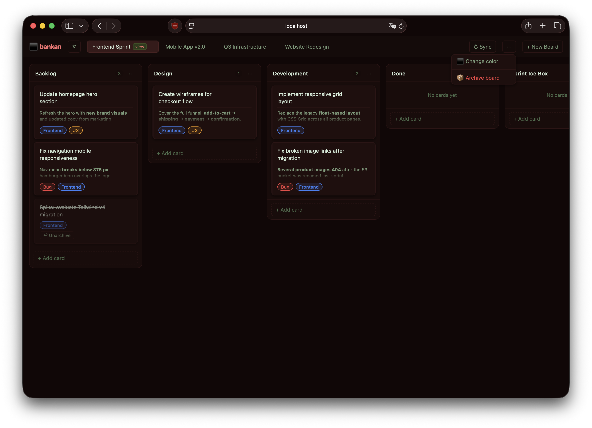
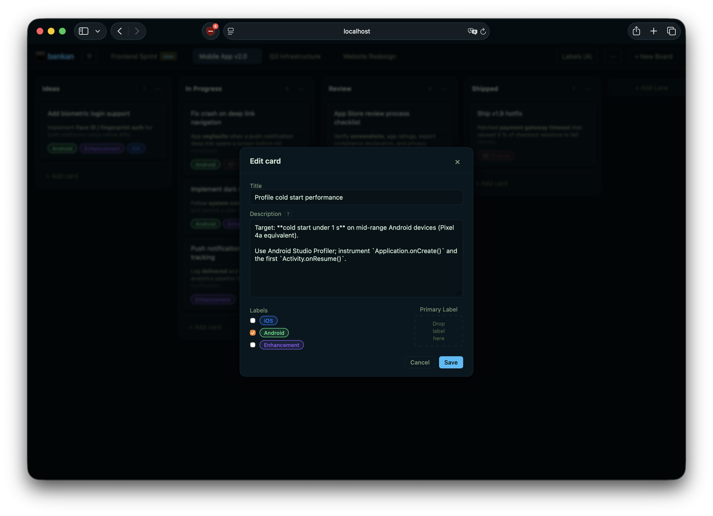

# bankan

A local-first kanban board manager for people who want their boards in git.

 

> **DISCLAIMER**: this is a heavily vibe-coded tool.

## What this is

`bankan` is a CLI + localhost web UI for managing multiple kanban boards. All state lives in plain markdown files with YAML frontmatter - no database, no daemon, no cloud. A board is just a directory; `cp -r` is a complete backup.

This was built to scratch a personal itch. Other tools I tried were either too heavy, didn't integrate with the way I use git, or forced a workflow that didn't match how I need managed cards. It is not trying to be feature-rich or general-purpose. It does exactly what I need and nothing more.

Inspired by [signboard](https://github.com/cdevroe/signboard), which is a lovely concept but didn't quite match the flow I was after.

> **Heads up**: `bankan` is designed to run on `localhost` and is not suitable as a shared or multi-user tool. The HTTP server binds to `127.0.0.1` by default and uses a single static token - there is no per-user identity or access control.

## Why plain markdown files

- Boards live alongside source code and get committed to git. `git log` is your history; `git diff` shows what changed.
- You can read, search, and edit cards with any text editor.
- Copying a board directory is a complete, human-readable backup.
- No migration scripts when the format changes - the format is just files.

### What a board looks like on disk

```
my-board/
├── board.md              # board metadata + labels
├── 01-backlog/
│   ├── 001-ab12c-fix-login.md
│   └── 001-ab12c-fix-login.comments.md
├── 02-in-progress/
└── _archive/
```

A card file looks like:

```markdown
---
id: ab12c
title: Fix login bug
created_at: 2026-01-01T10:00:00Z
updated_at: 2026-01-02T15:30:00Z
labels:
  - ab1de
---

Card body in **markdown**.

- [ ] Check form validation
- [ ] Test on mobile
```

## Intended workflow

The design is built around a single main board that holds all tasks. Labels on that board represent categories (e.g. "Frontend", "Infra", "Bug") - each card gets a primary label and is highlighted in the board with the label's color, making it easy to see what category dominates a lane at a glance.

When it is time to run a sprint or an iteration, a **view board** is created from the main board filtered by one of those labels. The view board is semi-linked to its parent: it shares the parent's labels and reuses the parent's cards - it does not copy them. Moving a card in the view moves it on the parent too; adding a card via the view creates it on the parent with the filter label already applied.

Once the sprint is done, the view board is archived. The parent board and its cards are untouched. Archiving is just setting a flag in `view.md`.

```
main-board/          ← single source of truth
  labels: Frontend, Infra, Bug, ...
  cards: all tasks, each with a primary label

sprint-1-view/       ← view board, filtered by label "Frontend"
  shares main-board's lanes
  view-only lanes: "Sprint Icebox"
  archived after sprint ends

sprint-2-view/       ← next iteration, same pattern
```

## Workspaces

A workspace is a purely UI-level concept — it has no representation on disk. When `bankan serve` is given one or more root directories, each directory becomes a workspace: a named group of boards that are displayed together in the web UI under a shared tab.

```bash
# Single workspace (name derived from path)
bankan serve /my/project

# Multiple workspaces with explicit names
bankan serve my-team:/path/to/boards ops:/other/boards
```

If no argument is given, the current working directory is used as a single workspace. The workspace name defaults to the last two path components of the directory (e.g. `/a/b/myproject` → `"b/myproject"`), or can be set explicitly with the `name:path` syntax.

Name collisions are resolved automatically by appending `(1)`, `(2)`, … suffixes.

Workspaces exist only as a navigation grouping in the browser. All board state still lives in the underlying directories; workspaces are gone as soon as the server stops.

## Features

- Single main board with label-color-coded cards for at-a-glance categorization
- View boards - label-filtered, semi-linked subsets of a parent board for sprints/iterations
- Archive view boards when an iteration ends; parent cards are unaffected
- Lanes with drag-and-drop reordering
- Cards with title, markdown body, labels, comments
- Archive lane for completed or parked cards
- Hidden boards - keep a board accessible but out of the main tab bar
- Workspaces - UI-only grouping of boards served from the same root directory
- HTMX web UI served on localhost
- CLI for all operations

## Getting started

```bash
# Build
go build ./cmd/bankan

# Create a board
bankan board init ./my-board --name "My Board"

# Add lanes
bankan lane add "Backlog" --board ./my-board
bankan lane add "In Progress" --board ./my-board
bankan lane add "Done" --board ./my-board

# Add a card
bankan card add --lane "Backlog" --title "First task" --board ./my-board

# Start the web UI (serves on http://localhost:8080)
bankan serve ./my-board

# Serve two directories as named workspaces
bankan serve my-team:./my-board ops:./ops-board
```

The server prints an `X-Bankan-Token` on startup that is required for all mutating requests. Pass `--no-token` to disable this for local development.

### Try the demo

If you have [mise](https://mise.jdx.dev) installed, you can generate a set of sample boards and serve them to explore the workflow without setting anything up manually:

```bash
mise run demo-gen   # populate demo/ with three sample boards
mise run demo-serve # serve them at http://localhost:9091
```

## CLI overview

```
bankan board init / show / reorder / hide / unhide
bankan board view create / sync / show / archive

bankan lane add / list / rename / remove

bankan card add / list / show / edit / move / archive / restore / delete / duplicate / reorder / search
bankan comment add / edit / list
bankan label add / list / edit / remove [--force]

bankan serve          # start the web UI + REST API
bankan ai-skill       # generate an AI agent skill file (claude-code / opencode / codex)
```

Run `bankan <command> --help` for flags and examples.

### Label archiving

`bankan label remove <id>` **archives** the label by default: the name is
prefixed with `💼 ` so it is hidden from pickers but still visible on cards that
already carry it. This is the safe default — no card data is lost.

To permanently delete the label (and strip it from all cards on the next board
read), pass `--force`:

```bash
bankan label remove <id> --board ./my-board          # archive (default)
bankan label remove <id> --board ./my-board --force  # permanent delete
```

The REST API follows the same convention:
- `DELETE /api/v1/boards/{id}/labels/{labelId}` — archives (default)
- `DELETE /api/v1/boards/{id}/labels/{labelId}?force=true` — permanent delete

## AI agent integration (experimental)

`bankan` is a manual-use tool first. The `ai-skill` command is an experiment in discovering what an AI coding assistant could do with a board - it is not a supported or first-class integration. It writes a skill file (`SKILL.md`) describing the CLI interface. Supported formats: `claude-code`, `opencode`, `codex`.

```bash
bankan ai-skill --type claude-code ./.claude/
```

## Known limitations

These are intentional, not bugs:

- Card order prefix caps at 999 per lane.
- Lane reordering renames directories; moving lanes across boards is not supported.
- `moved_at` / `moved_from` record only the most recent move - full history lives in git.
- No concurrent write safety at the library level (the HTTP server adds per-board mutexes, direct library use from multiple goroutines is unsafe).
- A `---` line inside a comment body is swallowed by the parser - use `***` or `- - -` for horizontal rules inside comments.

## Requirements

- Go 1.22+
- [`templ`](https://templ.guide) (only needed if you modify UI templates)

## Contributing

The goal of this project is to stay lean. There are far more sophisticated kanban tools out there; this one exists because none of them matched a specific personal workflow. Contributions that add new features or expand scope are out of place here.

What is welcome, on a case-by-case basis:

- Bug fixes
- UX improvements to the existing web UI or CLI

If you have a fix or an improvement, open an issue first to discuss it before sending a PR.

## License

MIT
